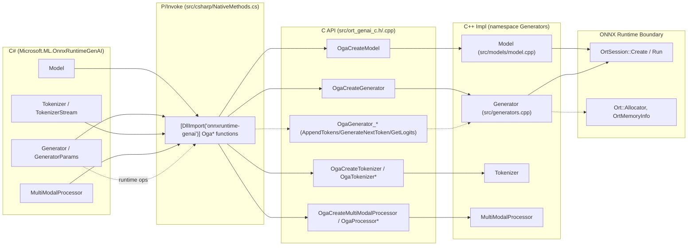
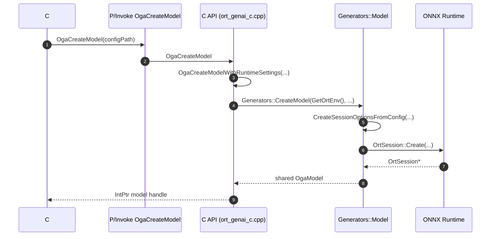
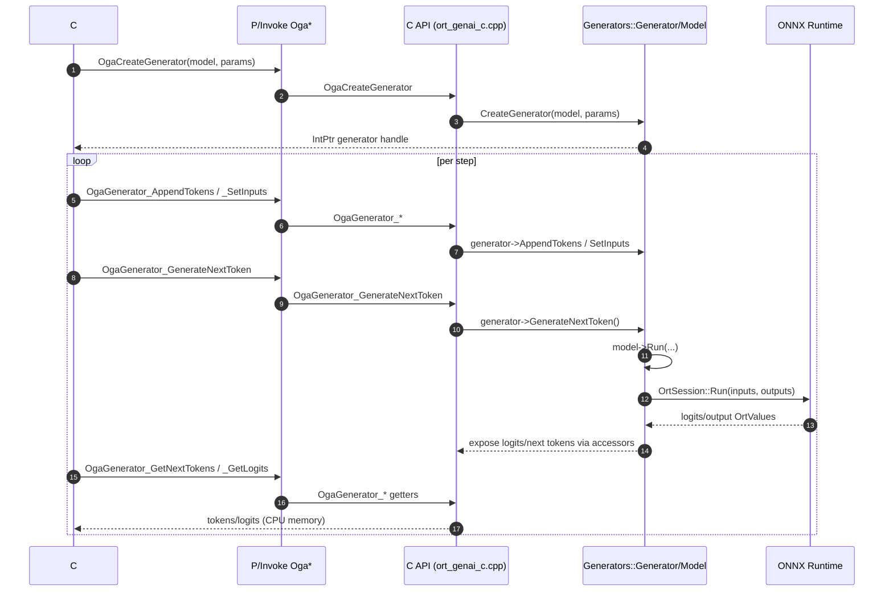
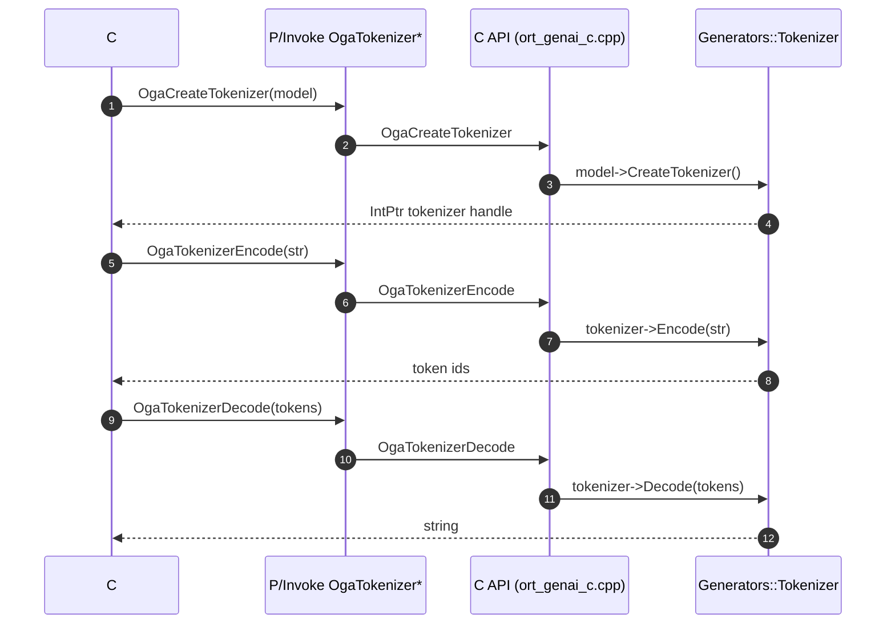
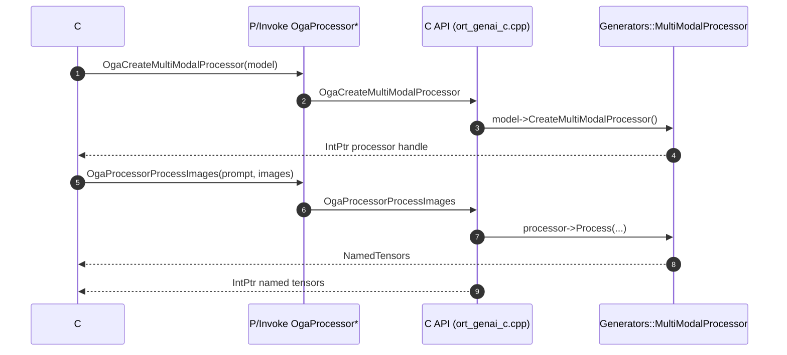
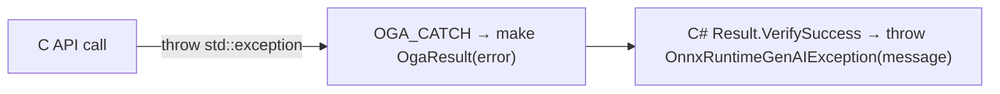

### ONNX Runtime GenAI: C# to Native Call Flow

This document diagrams the high-level flow from the C# API down to the native layers, stopping at ONNX Runtime. File and symbol names are shown for orientation.

Key C# entry points:
- `Model` (loads model/config)
- `Generator`, `GeneratorParams` (token generation)
- `Tokenizer`, `TokenizerStream` (text <-> tokens)
- `MultiModalProcessor` (image/audio preprocessing)

Native boundaries:
- P/Invoke to `onnxruntime-genai` via `src/csharp/NativeMethods.cs`
- C API in `src/ort_genai_c.h` implemented by `src/ort_genai_c.cpp`
- C++ implementation in `src/models/*.cpp`, `src/generators.cpp`, etc.
- ONNX Runtime boundary: `OrtSession::Create`, `OrtSession::Run`, allocators in `src/models/onnxruntime_api.h`, `src/models/model.cpp`

---

### Component Map (C# → P/Invoke → C API → C++ → ONNX Runtime)

---

### Model Construction Flow

Relevant code:
- `src/csharp/Model.cs` → `NativeMethods.OgaCreateModel`
- `src/ort_genai_c.cpp: OgaCreateModel` → `OgaCreateModelWithRuntimeSettings`
- `Generators::CreateModel` → `Model::CreateSessionOptions`, `Model::CreateSession`, `OrtSession::Create`

---

### Generation Loop Flow

Relevant code:
- `src/csharp/Generator.cs` → `NativeMethods.OgaCreateGenerator`
- `src/ort_genai_c.cpp: OgaCreateGenerator`, `OgaGenerator_*`
- `Generators::Generator::GenerateNextToken`, `Model::Run`
- ORT calls: `OrtSession::Run`

---

### Tokenizer Encode/Decode Flow

Relevant code:
- `src/csharp/Tokenizer.cs` → `OgaCreateTokenizer`, `OgaTokenizerEncode`, `OgaTokenizerDecode`
- `src/ort_genai_c.cpp: OgaCreateTokenizer`, `OgaTokenizer*`
- `Generators::Tokenizer`

---

### MultiModal Processor (Images/Audio → NamedTensors)

Relevant code:
- `src/csharp/MultiModalProcessor.cs` → `OgaCreateMultiModalProcessor`, `OgaProcessorProcess*`
- `src/ort_genai_c.cpp: OgaCreateMultiModalProcessor`, `OgaProcessorProcess*`
- `Generators::MultiModalProcessor`

---

### Error Handling (Result pattern)

Errors from native calls surface via `OgaResult`:
- C# wrappers call `Result.VerifySuccess(NativeMethods.Oga...(...))`
- C API returns `OgaResult*` on failure; message via `OgaResultGetError`
- Typical C entry: `OGA_TRY`/`OGA_CATCH` in `src/ort_genai_c.cpp`

---

### Stopping Boundary

These diagrams stop at ONNX Runtime calls within the native layer:
- `OrtSession::Create` and `OrtSession::Run` in `src/models/model.cpp`
- Allocators and device interfaces in `src/models/onnxruntime_api.h`

