### Agent Chat on Pure ONNX Runtime: Top-Down Algorithm

Goal: Outline how to implement an agentic chat loop using only ONNX Runtime (ORT) sessions for all model inference (LLM generation, embeddings, reranking), plus ordinary host code for memory, tools, and control flow.

Assumptions:
- Pre/post-processing (tokenization, detokenization, tool I/O marshalling) is implemented in host code.
- All neural inference is done via ORT `OrtSession::Run` on ONNX models: LLM, embedding model, reranker or tool classifier (optional), vision/audio encoders (optional).

---

### Components (Top-Down)


---

### One Chat Turn (with Tools and Memory)

```mermaid
sequenceDiagram
  autonumber
  participant C as Client/UI
  participant O as Orchestrator (host)
  participant MEM as Memory (ConvLog/VecStore)
  participant EMB as ORT Embedding Session
  participant L as ORT LLM Session
  participant T as Tools (Adapters -> Tool Impl)

  C->>O: send user message
  O->>MEM: fetch recent convo turns
  O->>EMB: Run() to embed user query
  MEM-->>O: retrieve top-k docs via ANN
  O->>L: Build prompt+context -> token IDs -> Run(step): logits → token
  note right of L: Streaming loop: step-wise Run() + decode

  alt model suggests tool call (via structured output or function tokens)
    O->>T: parse tool args -> call tool
    T-->>O: tool result (JSON/text)
    O->>L: Append tool result to context -> continue Run(step)
  else
    O-->>C: stream tokens as assistant reply
  end

  O->>EMB: Run() to embed chunks of final answer (optional)
  O->>MEM: write convo turn + tool results, update VecStore with embeddings
  O-->>C: done
```



---

### ORT Usage: Sessions and Runs


Inputs/Outputs (typical):
- LLM inputs: `input_ids`, `position_ids`, `attention_mask`, `past_key_values` (kv-cache tensors per layer)
- LLM outputs: `logits` (and updated `present_key_values`)
- Embedding inputs: tokenized text; outputs: dense vector(s)

---

### Generation Loop (Step-wise Decoding with ORT)


Sampling is host-implemented (no ORT call): greedy, top-k/top-p, temperature, repetition penalty, etc. KV-cache routing is model-dependent; with ORT you pass and receive the cache tensors each step.

---

### Tool Use Decision Paths (Options)


Implementation choices:
- Structured output via constrained decoding (enforce a JSON schema at sampling time, host-side)
- Separate ORT classifier to decide if a tool call is needed

---

### Retrieval-Augmented Generation (RAG) with ORT


Write-back:
- Optionally embed user message and assistant answer with `EMB.Run()` and upsert to `V` for long-term memory.

---

### Memory Write-Back and Summarization


---

### Minimal Pseudocode (Host)

```text
initialize OrtEnv
create sessions: llm_sess, emb_sess, (optional) rerank_sess, vision_sess

for each chat turn:
  convo_ctx = memory.fetch_recent()
  retrieved = retrieve_with_embeddings(emb_sess, user_msg)
  prompt = format_prompt(convo_ctx, retrieved, user_msg)
  tokens, kv = tokenize(prompt), None

  while not stop:
    logits, kv = llm_sess.Run(inputs(tokens.last, kv, masks))
    next_token = sample(logits)
    stream(next_token)
    if is_function_token(next_token):
      call = parse_function(tokens)
      tool_result = execute_tool(call)
      tokens += tokenize(format_tool_result(tool_result))
    if stopping_condition(tokens): break

  answer = detokenize(tokens.new_segment)
  memory.write_back(user_msg, answer, tool_results)
  if long_term:
    emb = emb_sess.Run(tokenize(answer))
    vecstore.upsert(emb, metadata)
```

---

### Notes and Tips
- Manage kv-cache tensors explicitly per model; shape/layout are model-architecture specific.
- For streaming, run step-wise decoding and surface decoded tokens as they arrive.
- Control sampling determinism by fixing seed and using greedy/beam search.
- For multi-modal inputs, run encoder sessions (vision/audio) with ORT to produce embeddings/features, then feed into the LLM session.
- For throughput, batch multiple conversations if model supports batching; maintain separate kv-cache per sequence.


